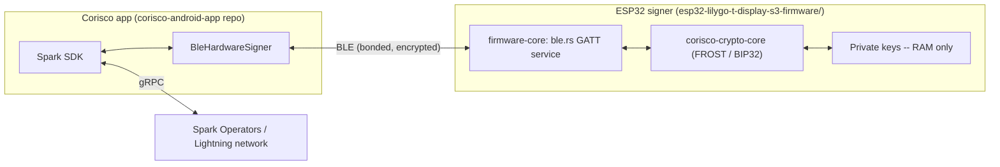

# corisco-wallet

A self-custodial Lightning wallet where the private keys never touch your
phone: a small ESP32-S3 hardware device holds the keys and signs every
transaction after you confirm it on the device's own screen. The phone
app (Corisco) talks to the device over Bluetooth LE and never sees key
material, only public keys and signature shares.

Built on [Spark](https://www.spark.money/)'s FROST-based threshold
signing protocol.

## How it fits together

The hard invariant: **private key material never leaves the ESP32.** The
signing logic itself lives in a separate crate,
[crypto-core](https://github.com/corisco-wallet/crypto-core), pulled in by
`firmware-core` as a dependency.

See [`docs/architecture.md`](docs/architecture.md) for the full
receive/send/sign walkthrough, request by request.

## Repo layout

| Path | What |
|---|---|
| `firmware-core/` | Board-agnostic firmware logic shared across ESP32/ESP-IDF boards: BLE GATT signing protocol, PIN-encrypted seed storage, RNG, Slint platform glue |
| `esp32-lilygo-t-display-s3-firmware/` | Rust firmware for the LilyGo T-Display-S3: display/touch drivers, on-device confirmation UI, boot sequence -- depends on `firmware-core` |
| `corisco-protocol/` | BLE wire protocol (postcard `Request`/`Response`, UUIDs, `PROTOCOL_VERSION`); host-buildable, no ESP deps |
| `protocol/` | `vectors.json`: golden wire vectors the mobile app is tested against |
| `docs/` | Architecture walkthrough and dev/test-wallet notes |

The mobile app lives in its own repo,
[corisco-android-app](https://github.com/corisco-wallet/corisco-android-app), and is tested against the wire-protocol
vectors published with each firmware release.

The firmware crates are members of one Cargo workspace rooted at the repo
root (see `Cargo.toml`).

## Quickstart

- **Firmware**: see
  [`esp32-lilygo-t-display-s3-firmware/README.md`](esp32-lilygo-t-display-s3-firmware/README.md)
  for hardware prerequisites, the Xtensa toolchain setup, and flashing.
- **Mobile app**: see the [corisco-android-app repo](https://github.com/corisco-wallet/corisco-android-app) for building
  and running the Android app.
- **Testing end to end**: [`docs/testing.md`](docs/testing.md) has two
  ready-made regtest wallets for exercising a real payment.

## Hardware

A [LilyGo T-Display-S3](https://github.com/Xinyuan-LilyGO/T-Display-S3)
(ESP32-S3, 170x320 ST7789 display, CST816S capacitive touch). No other
hardware variant is currently supported.

## Contributing

See [`CONTRIBUTING.md`](CONTRIBUTING.md). Security-relevant reports
(anything that looks like a real vulnerability, not just a bug) should
follow this org's `SECURITY.md` instead of a public issue.

## License

Licensed under either of [Apache License, Version 2.0](LICENSE-APACHE) or
[MIT license](LICENSE-MIT) at your option.
