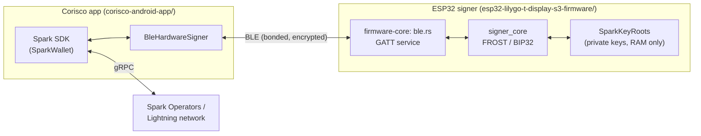
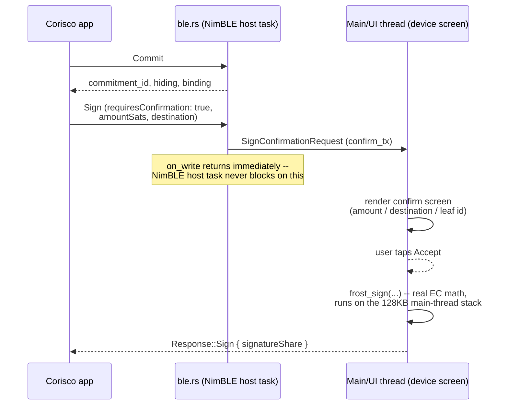

# Wallet flow: receiving, sending, and signing on the hardware device

This walks through how a payment actually moves through the system end to
end -- what the phone app does, what crosses BLE, and what the ESP32
signer does with it. For building/running the app, see
`corisco-android-app/README.md` and
`esp32-lilygo-t-display-s3-firmware/README.md`.

## Overview

Three components, one hard invariant:

The invariant: **private key material never leaves the ESP32.** The phone
only ever holds derived *public* keys and, per signing operation, a
signature share it forwards to the Spark network -- never a private key,
never a seed. `signer_core::SparkKeyRoots` lives only in the device's RAM
(itself unlocked from a PIN-encrypted blob on boot). The phone's
`BleHardwareSigner` (`corisco-android-app/src/ble-hardware-signer.ts`) implements
the SDK's `SparkSigner` interface entirely by asking the device over BLE
-- it has no fallback path that reads local key material for anything the
device doesn't answer.

## Pairing, briefly

Before any of the flows below can happen, the phone must have a live,
bonded BLE connection to the signer (`BleSignerConnection`,
`corisco-android-app/src/ble-transport.ts`) -- real BLE bonding with a passkey
shown on the device's own screen, not an open/unauthenticated link. Full
detail on pairing, the saved-signer list, and the wire framing is in
`corisco-android-app/README.md` and `firmware-core/src/ble.rs`'s module doc
comment; everything below assumes that connection already exists.

## Receiving

Receiving a Lightning payment needs **no physical confirmation at all**
-- by design. Claiming an incoming transfer is internal protocol
plumbing (taking cryptographic ownership of a leaf you're already meant
to receive), not a spend, so it's deliberately not gated on a screen tap.

1. **Create an invoice** -- `ReceiveScreen` calls
   `wallet.createLightningInvoice(...)` directly through the SDK. No
   signer involvement yet; this just asks the Spark Service Provider for
   a bolt11 invoice.
2. **A payment arrives** -- the Spark Operators notify the SDK of an
   incoming transfer. Nothing happens automatically on this app: the
   SDK's own background auto-claim is explicitly disabled in
   `App.tsx`'s `connectAndInit` (clearing `claimTransfersInterval`) in
   favor of an app-controlled claim, so every claim call has a known,
   traceable call site.
3. **Claiming** -- `App.tsx`'s `claimPending` calls
   `wallet.claimTransfers()`, wrapped in
   `signer.withoutSpendConfirmation(...)`. This runs on connect, on
   every manual refresh, and (for optimize) on a slow background timer --
   never on a fixed poll that fires regardless of whether anyone's
   looking.
4. **What that triggers over BLE** -- claiming a transfer needs several
   signatures, all internal:
   - **Refund-transaction signatures** (`Commit`/`Sign`, per leaf) --
     a safety mechanism letting the new leaf owner unilaterally exit if
     the Signing Operators go dark. Sent with `requiresConfirmation:
     false`, which `ble.rs`'s `handle_request` routes to
     `DeferredRequest::AutoSign` -- computed and returned immediately, no
     on-screen tap.
   - **`DecryptEciesToPublicKey`** -- `verifyPendingTransfer` (called
     from the SDK's `claimTransferCore`, before the key-tweak step) needs
     the public key of an ECIES-decrypted value; the device decrypts with
     its identity key internally but only ever returns the public key.
   - **`SubtractAndSplitSecretWithProofs`** -- the actual
     leaf-ownership-transfer "key tweak": the device subtracts two
     derived private keys and Shamir-splits (with Feldman proofs) the
     difference for the Signing Operators. This is what actually
     transfers cryptographic control of the leaf to this wallet.
5. **Result** -- the claimed leaf is now spendable. The SDK's own
   `BalanceUpdate`/`TransferClaimed` events push the new balance and
   transfer-list refresh to `HomeScreen` -- no polling needed on the
   phone side either.

None of this ever shows anything on the device's screen. That's
intentional: every one of these signatures is `requires_confirmation:
false` in the wire protocol, set by the app (not inferred by the device --
see `ble.rs`'s `Request::Sign` doc comment on why the device has no
reliable way to tell "refund tx" from "real spend" from the message bytes
alone).

## Sending

Sending is the opposite: **every signature that can move funds requires
a physical tap on the device**, deliberately without trying to guess
which one is "the real spend" and skip confirmation on the rest (see
below for why).

1. **Enter or scan an invoice** -- `SendScreen`. Pasting or scanning a
   bolt11 invoice runs `decodeInvoiceAmountSats`: a fixed-amount invoice
   auto-fills and locks the amount field; a 0-amount invoice leaves it
   editable and required (passed later as `amountSatsToSend`).
2. **Pay** -- `pay()` wraps `wallet.payLightningInvoice(...)` in
   `signer.withSpendContext({ amountSats, destination }, ...)`. Every
   `signFrost` call the SDK makes while that context is active gets
   `amountSats`/`destination` attached for the confirm screen.
3. **What that triggers over BLE**:
   - **`SubtractSplitAndEncrypt`** (only if the leaves don't sum to the
     exact invoice amount) -- the sending-side counterpart to the claim
     flow's key tweak: the SSP needs a leaf swapped for one that matches,
     so the device subtracts two derived keys, Shamir-splits the
     difference, and ECIES-encrypts the fresh key to the receiver so
     *they* can later claim it.
   - **One or more `Sign` requests** (`Commit` + `Sign` per leaf/round)
     with `requiresConfirmation: true` and the amount/destination
     attached. **Every single one** gates on the physical confirm screen
     -- a payment that needs several leaves combined produces one prompt
     per leaf, not one prompt total.
4. **Why it can't safely collapse to one prompt**: this was tried --
   filtering on "was this leaf already mine before the payment started,"
   the same kind of check that safely distinguishes a claim's refund-tx
   signatures from a real spend -- and found unsafe on real hardware: a
   real payment signed and completed with **the confirmation screen never
   appearing at all**. Unlike the claim side (verified by reading
   `claimTransferCore`'s actual source), `payLightningInvoice`'s internal
   signing order was never traced the same way, and the leaf-swap it
   performs most likely signs with a *freshly swapped* leaf for the real
   payment -- exactly the "not in my pre-payment snapshot" case the
   filter was treating as safe to auto-approve. A hardware wallet that
   silently signs a real spend is a much worse failure than one that asks
   more than once, so every `Sign` during an active spend context
   requires confirmation, unconditionally (`ble-hardware-signer.ts`'s
   `withSpendContext` doc comment has the full account).
5. **The trust model, explicitly**: the amount and destination shown on
   the confirm screen are **app-asserted, not cryptographically
   verified**. By the time `SignFrostParams.message` reaches the signer
   it's already a one-way sighash -- the SDK never hands a custom
   `SparkSigner` the raw transaction it was computed from, so the device
   has no way to independently recompute or check what it's being told.
   A dishonest or compromised phone could show one thing on this screen
   and sign something else. This is the same trust model most software
   Lightning wallets already operate under; the hardware signer adds a
   second screen and a physical tap, not independent verification of
   *what* is being signed.

## Signing on the hardware device

This is what happens inside `firmware-core/src/ble.rs` once a `Sign`
request (or any other BLE request) actually lands.

**Framing.** BLE's negotiated ATT MTU caps how much fits in one
write/indication, so every request/response is length-prefixed and
chunked; the receiver buffers frames until it has the full message, then
decodes it (`RequestReassembly` on the device, `ResponseReassembly` on
the phone). Indications, not notifications, carry responses back --
confirmed at the link layer, so frames arrive in order with no loss and
no bespoke ACK scheme needed.

**Why signing can't just run inline.** `on_write`'s callback -- where a
decoded request first gets handled -- runs synchronously on the NimBLE
host task's own small (16KB) stack. FROST/BIP32 curve math overflowed
that stack on real hardware the moment a real request needing it arrived.
So every request needing *fresh* elliptic-curve computation (`Commit`,
`Sign`, leaf public keys, identity signing, the key-tweak operations) is
packaged into a `DeferredRequest` and handed off over a channel to the
main/UI thread, which has a proven-sufficient 128KB stack (the same one
`frost_self_test` already exercises every boot). `run_deferred` does the
actual computation there and sends the response -- `handle_request`
itself never blocks the BLE callback on math, only on a channel `send`.

**The confirm screen.** A `Sign` request with `requires_confirmation:
true` doesn't go through `run_deferred` automatically -- it's boxed into
a `SignConfirmationRequest` and sent to `signer.confirm_tx`, which the
main thread drains into screen 4 of `app.slint`:

- If the app supplied `amount_sats`/`destination`: "Send `<amount>`
  sats" / "to `<destination>`" / "leaf `<short id>`" (the leaf id is
  always shown, even with a real amount -- a multi-leaf payment produces
  several prompts, and without a distinguishing leaf id they'd look like
  the same payment being asked for twice).
- Otherwise (no confirmation, or the app didn't supply that context):
  "Confirm signature" / leaf id / a short fingerprint of the message
  being signed.
- **Accept** -> `complete_sign(req, true)` runs the real
  `signer_core::frost::frost_sign` and sends `Response::Sign` with the
  actual signature share.
- **Decline** -> `complete_sign(req, false)` sends `Response::Error`
  ("declined on device") -- no signing call happens at all.

## Quick reference: wire requests and confirmation gating

| Request | Triggered by | Confirmation | Notes |
|---|---|---|---|
| `Commit` | Any `signFrost` round 1 | none (auto) | Cheap FROST nonce generation, deferred off the BLE stack but never gated on a screen. |
| `Sign` | `signFrost` round 2 | `requires_confirmation` field, app-set | `false` for claim refund-tx signatures (`withoutSpendConfirmation`); `true` for anything during a `withSpendContext` send. |
| `GetIdentityPublicKey` / `GetDepositPublicKey` | Various SDK calls | none | Answered inline -- already-computed bytes from boot, no fresh math. |
| `GetLeafPublicKey` | Leaf key lookups | none (auto) | Fresh BIP32 derivation, deferred but not gated -- a public key alone can't move funds. |
| `SignSchnorrIdentity` / `SignEcdsaIdentity` | Identity-key auth (e.g. `SparkWalletClient.authenticate`) | none (auto) | Login/auth signatures, not a leaf spend. |
| `SubtractAndSplitSecretWithProofs` | Claiming (`verifyPendingTransfer`'s key tweak) | none (auto) | Wrapped in `withoutSpendConfirmation` by the app. |
| `DecryptEciesToPublicKey` | Claiming (`verifyPendingTransfer`) | none (auto) | Returns only a public key, never the decrypted private value. |
| `SubtractSplitAndEncrypt` | Sending a non-exact-denomination payment | none (auto) | The leaf-swap key tweak itself doesn't move funds -- the `Sign` that follows it does, and that one *is* gated. |

"Auto" above means the wire-level `requires_confirmation`/gating doesn't
apply to that request type at all (no fund-moving signature is produced),
not that it silently skips a check that would otherwise apply.
